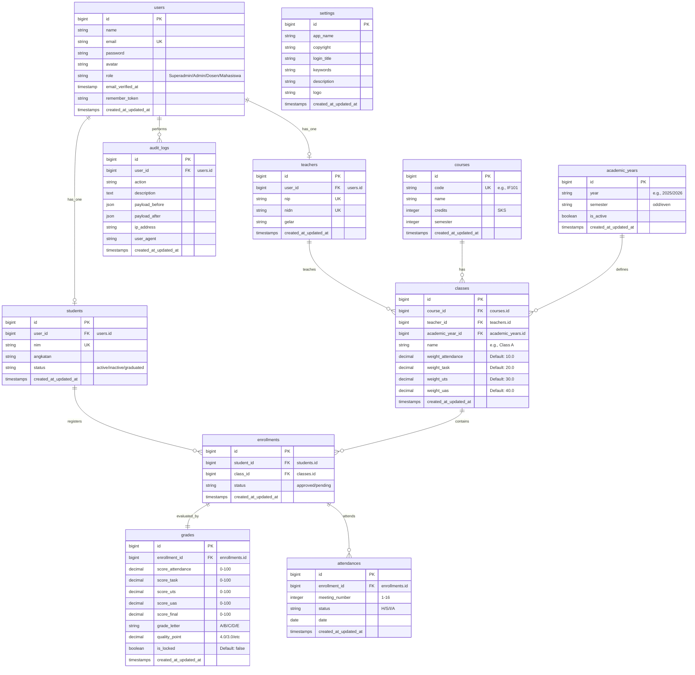
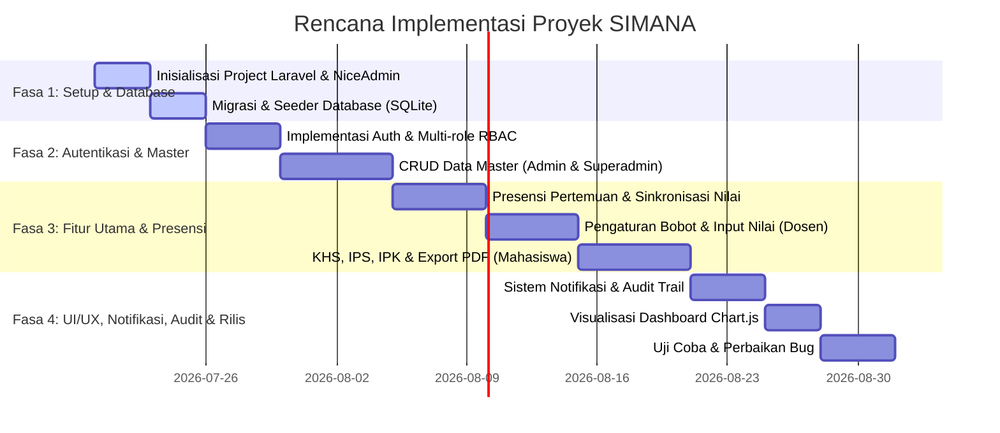

# Product Requirement Document (PRD)
## Sistem Manajemen Nilai Akademik (SIMANA)

| **Atribut** | **Detail** |
|---|---|
| **Nama Proyek** | Sistem Manajemen Nilai Akademik (SIMANA) |
| **Status** | Terimplementasi - Final Dokumentasi |
| **Pemilik Produk** | Senior Product Manager & Tech Lead |
| **Target Rilis** | Q3 2026 |
| **Dokumen Versi** | 1.1.0 |

---

## 1. Pendahuluan & Latar Belakang
Proses rekapitulasi, perhitungan, dan publikasi nilai akademik di institusi pendidikan sering kali masih mengalami kendala inefisiensi, kerentanan manipulasi data, dan keterlambatan penyampaian informasi kepada mahasiswa. 

**Sistem Manajemen Nilai Akademik (SIMANA)** dirancang sebagai platform terintegrasi untuk mengotomatisasi seluruh siklus manajemen nilai—mulai dari plotting mata kuliah, pengisian komponen nilai oleh dosen, penghitungan nilai akhir otomatis berbasis bobot dinamis, hingga penerbitan Kartu Hasil Studi (KHS) mahasiswa. Sistem ini dibangun menggunakan backend **Laravel 13.0**, frontend **Tailwind CSS v4.0** dan **Bootstrap 5 (NiceAdmin Template)** dengan database **SQLite** untuk portabilitas yang tinggi.

---

## 2. Tujuan & Matriks Keberhasilan (OKRs)

### 2.1 Tujuan Produk
- **Otomatisasi Penghitungan**: Menghilangkan kesalahan manusia (human error) dalam penghitungan nilai akhir berdasarkan bobot komponen (Tugas, UTS, UAS, Kehadiran).
- **Transparansi**: Menyediakan akses real-time bagi mahasiswa terhadap perkembangan nilai akademik mereka.
- **Efisiensi Kerja**: Memangkas waktu dosen dalam memasukkan nilai kelas dan mengelola presensi dari hitungan hari menjadi hitungan menit.

### 2.2 Key Performance Indicators (KPIs)
- **Akurasi Perhitungan**: 100% akurasi perhitungan nilai akhir berdasarkan formula bobot yang disepakati.
- **Waktu Input**: Rata-rata pengisian nilai satu kelas berkapasitas 40 mahasiswa selesai dalam < 5 menit.
- **Aksesibilitas**: Sistem 100% responsif pada perangkat mobile (smartphone) untuk memudahkan mahasiswa melihat nilai dan presensi.

---

## 3. Pengguna & Persona (User Roles)

Sistem ini menerapkan konsep **Role-Based Access Control (RBAC)** dengan 4 aktor utama:

1. **Superadmin**
   - Memiliki hak akses penuh terhadap seluruh fitur sistem, termasuk pengelolaan pengguna, data master, dan log audit.
   - Dapat mengubah pengaturan instansi global (nama aplikasi, logo, dll.).
   - Memiliki fitur Switch User untuk berpindah peran langsung ke aktor lain demi kemudahan pengujian.

2. **Administrator (Staf Akademik / IT)**
   - Mengelola data master (Mahasiswa, Dosen, Mata Kuliah, Kelas Perkuliahan, Tahun Akademik).
   - Mengelola akun pengguna dan pembagian hak akses (role).
   - Membuka dan menutup periode pengisian nilai.
   - Mengakses dashboard analisis akademik global.
   - Memiliki fitur Switch User untuk beralih peran ke Dosen atau Mahasiswa demi kemudahan pengujian.

3. **Dosen**
   - Melihat daftar kelas yang diampu pada semester aktif.
   - Mengonfigurasi bobot komponen nilai (tugas, UTS, UAS, presensi, dll.) secara dinamis per kelas.
   - Mencatat presensi/kehadiran mahasiswa per pertemuan (1 s.d. 16 pertemuan) yang terintegrasi langsung dengan kalkulasi nilai akhir.
   - Menginput nilai mahasiswa per kelas secara kolektif.
   - Menghasikan nilai akhir dan nilai huruf otomatis.
   - Mengunci (finalize) nilai agar tidak bisa diubah kembali untuk menjaga integritas data.

4. **Mahasiswa**
   - Melihat Kartu Hasil Studi (KHS) per semester aktif secara real-time.
   - Melihat riwayat nilai akademik (Transkrip Akademik Sementara).
   - Melihat visualisasi IPK (Indeks Prestasi Kumulatif) dan IPS (Indeks Prestasi Semester) dalam bentuk chart perkembangan.
   - Mengunduh atau mencetak KHS dalam format PDF.
   - Menerima notifikasi internal (in-app) dan email saat nilai kelas telah difinalisasi oleh dosen.

---

## 4. Persyaratan Fungsional (Functional Requirements)

### 4.1 Modul Autentikasi & Profil
- **FR-AUTH-01**: Sistem harus menyediakan form login aman dengan enkripsi password (Bcrypt).
- **FR-AUTH-02**: Sistem harus mengarahkan pengguna ke dashboard yang sesuai setelah login sukses berdasarkan role mereka.
- **FR-AUTH-03**: Pengguna dapat memperbarui profil dasar (nama, email, password) dan mengunggah foto profil (avatar) secara mandiri.
- **FR-AUTH-04**: Sistem menyediakan fitur Switch User bagi Superadmin dan Admin untuk berpindah peran secara cepat ke akun Mahasiswa atau Dosen untuk tujuan kemudahan pengujian.

### 4.2 Modul Data Master (Admin & Superadmin Only)
- **FR-MSTR-01**: Admin/Superadmin dapat mengelola CRUD data Dosen (NIDN, NIP, Nama, Gelar, status).
- **FR-MSTR-02**: Admin/Superadmin dapat mengelola CRUD data Mahasiswa (NIM, Nama, Angkatan, status aktif).
- **FR-MSTR-03**: Admin/Superadmin dapat mengelola CRUD data Mata Kuliah (Kode MK, Nama MK, SKS, Semester).
- **FR-MSTR-04**: Admin/Superadmin dapat mengelola CRUD Tahun Akademik (Tahun Ajaran, Semester Ganjil/Genap, status aktif/non-aktif).
- **FR-MSTR-05**: Admin/Superadmin dapat membuat Kelas Perkuliahan (menghubungkan Mata Kuliah, Dosen Pengampu, dan Tahun Akademik) serta mengatur bobot default penilaian.
- **FR-MSTR-06**: Superadmin dapat mengelola konfigurasi sistem instansi (Nama Aplikasi, Hak Cipta, Judul Login, Kata Kunci, Deskripsi, dan File Logo).

### 4.3 Modul KRS & Enrollment (Admin/Superadmin)
- **FR-KRS-01**: Sistem mendukung pencatatan pengambilan kelas oleh mahasiswa (enrollment) untuk semester aktif.
- **FR-KRS-02**: Admin/Superadmin dapat mendaftarkan mahasiswa secara manual per kelas (pencatatan enrollment).

### 4.4 Modul Presensi Kehadiran (Dosen)
- **FR-PRES-01**: Dosen dapat melakukan pencatatan kehadiran mahasiswa per kelas perkuliahan hingga 16 kali pertemuan. Opsi status kehadiran mencakup Hadir (H), Sakit (S), Izin (I), dan Alpa (A).
- **FR-PRES-02**: Sistem menghitung persentase kehadiran mahasiswa secara otomatis:
  $$\text{Persentase Kehadiran} = \frac{\text{Jumlah Hadir}}{\text{Total Pertemuan yang Diisi}} \times 100\%$$
- **FR-PRES-03**: Sistem secara dinamis menyinkronkan persentase kehadiran tersebut ke kolom nilai kehadiran (`score_attendance`) pada tabel `grades` mahasiswa yang bersangkutan, asalkan status nilai belum dikunci (`is_locked = false`).

### 4.5 Modul Pengisian & Penghitungan Nilai (Dosen)
- **FR-VAL-01**: Dosen dapat mengatur bobot penilaian untuk kelas yang diampu (misalnya: Kehadiran 10%, Tugas 20%, UTS 30%, UAS 40%). Total bobot harus bernilai tepat 100%.
- **FR-VAL-02**: Dosen dapat menginput komponen nilai mentah (Tugas, UTS, UAS) untuk setiap mahasiswa terdaftar. Komponen kehadiran (`score_attendance`) dihitung otomatis dari modul presensi namun tetap dapat disesuaikan jika diperlukan.
- **FR-VAL-03**: Sistem secara otomatis menghitung Nilai Akhir (Skala 0-100) menggunakan bobot kelas.
- **FR-VAL-04**: Sistem secara otomatis mengonversi Nilai Akhir menjadi Nilai Huruf dan Bobot Angka Mutu berdasarkan aturan standar:
  - $\ge 85$: **A** (4.0)
  - $80 - 84.99$: **A-** (3.7)
  - $75 - 79.99$: **B+** (3.3)
  - $70 - 74.99$: **B** (3.0)
  - $65 - 69.99$: **B-** (2.7)
  - $60 - 64.99$: **C+** (2.3)
  - $55 - 59.99$: **C** (2.0)
  - $40 - 54.99$: **D** (1.0)
  - $< 40$: **E** (0.0)
- **FR-VAL-05**: Dosen dapat melakukan "Finalisasi Nilai". Nilai yang difinalisasi akan langsung dirilis kepada mahasiswa dan dikunci dari perubahan lebih lanjut (`is_locked = true`).

### 4.6 Modul KHS & Transkrip (Mahasiswa)
- **FR-REP-01**: Mahasiswa dapat melihat Kartu Hasil Studi (KHS) per semester.
- **FR-REP-02**: Sistem menghitung IPS (Indeks Prestasi Semester) berdasarkan formula SKS dan Angka Mutu.
- **FR-REP-03**: Sistem menghitung IPK secara kumulatif dari seluruh semester yang telah dilalui.
- **FR-REP-04**: Mahasiswa dapat mengunduh atau mencetak KHS dalam format dokumen PDF resmi yang dihasilkan menggunakan library `laravel-dompdf`.

### 4.7 Modul Notifikasi & Komunikasi (Mahasiswa)
- **FR-NOTIF-01**: Saat dosen melakukan finalisasi nilai kelas perkuliahan, sistem secara otomatis mengirimkan notifikasi internal (in-app) dan email kepada seluruh mahasiswa yang terdaftar di kelas tersebut.
- **FR-NOTIF-02**: Tampilan header aplikasi menyertakan ikon lonceng notifikasi dengan penanda (badge count) jumlah notifikasi belum dibaca (unread).

### 4.8 Modul Log Audit & Keamanan (Superadmin)
- **FR-AUDIT-01**: Sistem secara otomatis merekam setiap perubahan nilai mahasiswa ke dalam log audit (`audit_logs`), termasuk nilai sebelum, nilai sesudah, identitas pengubah, waktu, alamat IP, dan user agent.
- **FR-AUDIT-02**: Aktivitas keamanan penting lainnya (seperti kegagalan login, perubahan password pengguna, dan penghapusan pengguna) juga direkam secara otomatis.
- **FR-AUDIT-03**: Halaman khusus Log Audit disediakan bagi Superadmin untuk memantau, mencari, dan memfilter seluruh aktivitas sistem.

### 4.9 Modul Visualisasi & Dashboard
- **FR-DSH-01**: Dashboard Superadmin menampilkan metrik global serta tabel log audit terbaru untuk pemantauan cepat.
- **FR-DSH-02**: Dashboard Admin menampilkan jumlah mahasiswa/dosen aktif, status periode akademik, serta ringkasan master data lainnya.
- **FR-DSH-03**: Dashboard Dosen menampilkan daftar kelas diampu, jumlah mahasiswa bimbingan, serta visualisasi histogram distribusi nilai (A, B, C, D, E) untuk kelas terkait.
- **FR-DSH-04**: Dashboard Mahasiswa menampilkan visualisasi tren IPS antar-semester menggunakan grafik garis (line chart) dari Chart.js, serta informasi ringkasan IPK dan total SKS.

---

## 5. Arsitektur & Skema Data (Database Schema)

### 5.1 Penjelasan Naratif Struktur Database
Sistem ini menggunakan database relasional **SQLite** dengan rancangan tabel sebagai berikut:

1. **`users`**: Menyimpan kredensial dasar, avatar, dan hak akses utama (`role`).
2. **`teachers` (Dosen)**: Terhubung *one-to-one* dengan `users`. Menyimpan data spesifik dosen (NIDN, NIP, gelar).
3. **`students` (Mahasiswa)**: Terhubung *one-to-one* dengan `users`. Menyimpan data akademik mahasiswa (NIM, angkatan, status).
4. **`academic_years`**: Menyimpan daftar tahun akademik, semester (Ganjil/Genap), dan status aktif.
5. **`courses`**: Menyimpan data mata kuliah, SKS, dan semester berjalan.
6. **`classes`**: Entitas kelas berjalan yang menghubungkan `courses`, `teachers`, dan `academic_years`. Mengatur bobot dinamis penilaian kelas.
7. **`enrollments`**: Menyimpan data pendaftaran kelas oleh mahasiswa (`students` ke `classes`).
8. **`grades`**: Menyimpan detail nilai mentah mahasiswa (kehadiran, tugas, UTS, UAS), nilai akhir, nilai huruf, angka mutu, dan status finalisasi (`is_locked`).
9. **`attendances`**: Menyimpan data presensi kehadiran mahasiswa per pertemuan (1 s.d. 16) yang terhubung ke `enrollments`.
10. **`audit_logs`**: Menyimpan rekaman jejak audit aktivitas sensitif yang terhubung ke `users`.
11. **`settings`**: Menyimpan konfigurasi global aplikasi (nama aplikasi, copyright, logo, dll.).
12. **`notifications`**: Tabel polymorphic bawaan Laravel untuk menyimpan status dan konten notifikasi pengguna.

---

### 5.2 Visualisasi Entity Relationship Diagram (ERD)

Berikut adalah relasi antar-entitas dalam SIMANA divisualisasikan dengan **Mermaid Diagram**:

---

## 6. Persyaratan Non-Fungsional (Non-Functional Requirements)

### 6.1 Keamanan (Security)
- **Enkripsi**: Password wajib menggunakan hashing algoritma Bcrypt (bawaan Laravel).
- **Proteksi CSRF**: Setiap form input POST/PUT wajib menyertakan token CSRF untuk mencegah serangan Cross-Site Request Forgery.
- **SQL Injection Prevention**: Seluruh query database harus menggunakan Laravel ORM (Eloquent) atau Query Builder dengan parameter binding untuk mencegah SQL injection.
- **Otorisasi Ketat (RBAC)**: Pengguna tidak boleh diizinkan memanggil endpoint API atau URL yang berada di luar wewenang role mereka (dijamin via Middleware Laravel).

### 6.2 Performa (Performance)
- **Query Optimization**: Gunakan *Eager Loading* (`with()`) pada Eloquent untuk mencegah masalah kueri $N+1$ saat memuat relasi kelas, mahasiswa, dan nilai.
- **Page Load Time**: Halaman dashboard utama harus dapat dimuat penuh dalam waktu kurang dari 2 detik pada koneksi internet standar (3G/4G).

### 6.3 Desain & Antarmuka (UI/UX)
- **Kesesuaian Tema**: Antarmuka web harus sepenuhnya mengadopsi elemen dari template **NiceAdmin (Bootstrap 5)** dan dikustomisasi dengan **Tailwind CSS v4.0** untuk responsivitas tinggi.
- **Responsivitas**: Tampilan wajib responsif penuh dari resolusi layar mobile (320px) hingga desktop ultra-wide.
- **Umpan Balik Pengguna**: Menyediakan pesan sukses (Flash Message) atau modal konfirmasi sebelum aksi krusial (seperti mengunci nilai permanen).

---

## 7. Rencana Rilis & Milestones

Siklus pengembangan dibagi menjadi 4 tahapan logis:

---
**Dokumen ini disetujui oleh:**
- **Product Owner**: [________________________] Tanggal: ______________
- **Tech Lead**: [________________________] Tanggal: ______________
- **Lead QA**: [________________________] Tanggal: ______________
