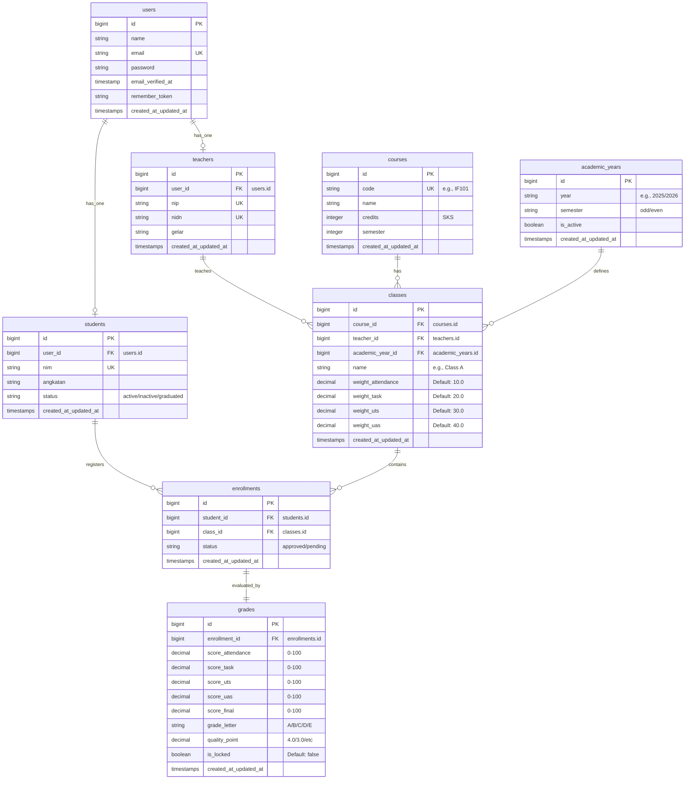
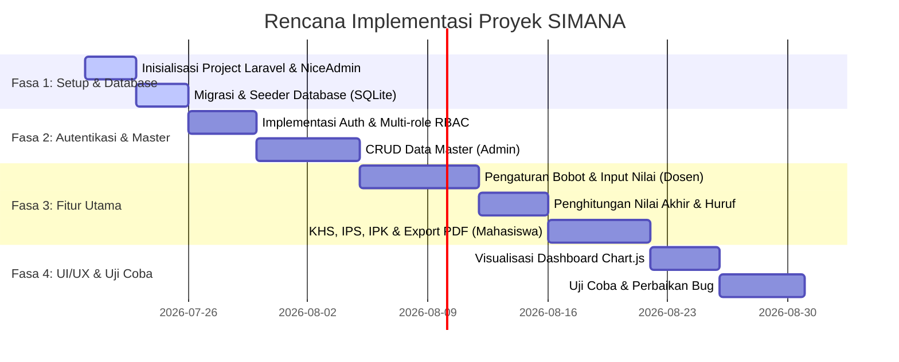

# Product Requirement Document (PRD)
## Sistem Manajemen Nilai Akademik (SIMANA)

| **Atribut** | **Detail** |
|---|---|
| **Nama Proyek** | Sistem Manajemen Nilai Akademik (SIMANA) |
| **Status** | Draft - Proposal Teknis & Fungsional |
| **Pemilik Produk** | Senior Product Manager & Tech Lead |
| **Target Rilis** | Q3 2026 |
| **Dokumen Versi** | 1.0.0 |

---

## 1. Pendahuluan & Latar Belakang
Proses rekapitulasi, perhitungan, dan publikasi nilai akademik di institusi pendidikan sering kali masih mengalami kendala inefisiensi, kerentanan manipulasi data, dan keterlambatan penyampaian informasi kepada mahasiswa. 

**Sistem Manajemen Nilai Akademik (SIMANA)** dirancang sebagai platform terintegrasi untuk mengotomatisasi seluruh siklus manajemen nilai—mulai dari plotting mata kuliah, pengisian komponen nilai oleh dosen, penghitungan nilai akhir otomatis berbasis bobot dinamis, hingga penerbitan Kartu Hasil Studi (KHS) mahasiswa. Sistem ini akan diintegrasikan dengan tema **NiceAdmin Bootstrap** yang responsif dan modern dengan backend **Laravel** dan database **SQLite** untuk portabilitas yang tinggi.

---

## 2. Tujuan & Matriks Keberhasilan (OKRs)

### 2.1 Tujuan Produk
- **Otomatisasi Penghitungan**: Menghilangkan kesalahan manusia (human error) dalam penghitungan nilai akhir berdasarkan bobot komponen (Tugas, UTS, UAS, Kehadiran).
- **Transparansi**: Menyediakan akses real-time bagi mahasiswa terhadap perkembangan nilai akademik mereka.
- **Efisiensi Kerja**: Memangkas waktu dosen dalam memasukkan nilai kelas dari hitungan hari menjadi hitungan menit.

### 2.2 Key Performance Indicators (KPIs)
- **Akurasi Perhitungan**: 100% akurasi perhitungan nilai akhir berdasarkan formula bobot yang disepakati.
- **Waktu Input**: Rata-rata pengisian nilai satu kelas berkapasitas 40 mahasiswa selesai dalam < 5 menit.
- **Aksesibilitas**: Sistem 100% responsif pada perangkat mobile (smartphone) untuk memudahkan mahasiswa melihat nilai.

---

## 3. Pengguna & Persona (User Roles)

Sistem ini menerapkan konsep **Role-Based Access Control (RBAC)** dengan 3 aktor utama:

1. **Administrator (Staf Akademik / IT)**
   - Mengelola data master (Mahasiswa, Dosen, Mata Kuliah, Kelas, Tahun Akademik).
   - Mengelola akun pengguna dan pembagian hak akses (role).
   - Membuka dan menutup periode pengisian nilai.
   - Mengakses dashboard analisis akademik global.

2. **Dosen**
   - Melihat daftar kelas yang diampu pada semester aktif.
   - Mengonfigurasi bobot komponen nilai (tugas, UTS, UAS, presensi, dll.) secara dinamis per kelas.
   - Menginput nilai mahasiswa per kelas secara kolektif.
   - Menghasilkan nilai akhir dan nilai huruf otomatis.
   - Mengunci (finalize) nilai agar tidak bisa diubah kembali setelah batas waktu berakhir.

3. **Mahasiswa**
   - Melihat Kartu Hasil Studi (KHS) per semester.
   - Melihat riwayat nilai akademik (Transkrip Akademik Sementara).
   - Melihat visualisasi IPK (Indeks Prestasi Kumulatif) dan IPS (Indeks Prestasi Semester) dalam bentuk chart perkembangan.

---

## 4. Persyaratan Fungsional (Functional Requirements)

### 4.1 Modul Autentikasi & Profil
- **FR-AUTH-01**: Sistem harus menyediakan form login aman dengan enkripsi password (Bcrypt).
- **FR-AUTH-02**: Sistem harus mengarahkan pengguna ke dashboard yang sesuai setelah login sukses berdasarkan role mereka.
- **FR-AUTH-03**: Pengguna dapat memperbarui profil dasar (foto, email, password) secara mandiri.

### 4.2 Modul Data Master (Admin Only)
- **FR-MSTR-01**: Admin dapat mengelola CRUD data Dosen (NIDN, NIP, Nama, Gelar, status).
- **FR-MSTR-02**: Admin dapat mengelola CRUD data Mahasiswa (NIM, Nama, Angkatan, Kelas, status aktif).
- **FR-MSTR-03**: Admin dapat mengelola CRUD data Mata Kuliah (Kode MK, Nama MK, SKS, Semester).
- **FR-MSTR-04**: Admin dapat mengelola CRUD Tahun Akademik (Tahun Ajaran, Semester Ganjil/Genap, status aktif/non-aktif).
- **FR-MSTR-05**: Admin dapat membuat Kelas Perkuliahan (menghubungkan Mata Kuliah, Dosen Pengampu, dan Tahun Akademik).

### 4.3 Modul KRS & Enrollment (Admin/Mahasiswa)
- **FR-KRS-01**: Sistem mendukung pencatatan pengambilan kelas oleh mahasiswa (enrollment) untuk semester aktif.
- **FR-KRS-02**: Admin dapat mengimpor data enrollment mahasiswa dalam skala besar (bulk import) atau mendaftarkan mahasiswa secara manual per kelas.

### 4.4 Modul Pengisian & Penghitungan Nilai (Dosen)
- **FR-VAL-01**: Dosen dapat mengatur bobot penilaian untuk kelas yang diampu (misalnya: Kehadiran 10%, Tugas 20%, UTS 30%, UAS 40%). Total bobot harus bernilai 100%.
- **FR-VAL-02**: Dosen dapat menginput komponen nilai mentah untuk setiap mahasiswa terdaftar.
- **FR-VAL-03**: Sistem secara otomatis menghitung Nilai Akhir (Skala 0-100).
- **FR-VAL-04**: Sistem secara otomatis mengonversi Nilai Akhir menjadi Nilai Huruf dan Bobot Angka Mutu berdasarkan aturan standar:
  - $\ge 85$: **A** (4.0)
  - $80 - 84.99$: **A-** (3.7)
  - $75 - 79.99$: **B+** (3.3)
  - $70 - 74.99$: **B** (3.0)
  - $65 - 69.99$: **B-** (2.7)
  - $60 - 64.99$: **C+** (2.3)
  - $55 - 59.99$: **C** (2.0)
  - $40 - 54.99$: **D** (1.0)
  - $< 40$: **E** (0.0)
- **FR-VAL-05**: Dosen dapat melakukan "Finalisasi Nilai". Nilai yang difinalisasi akan langsung dapat diakses oleh mahasiswa dan dikunci dari perubahan lebih lanjut.

### 4.5 Modul KHS & Transkrip (Mahasiswa & Orang Tua/Wali)
- **FR-REP-01**: Mahasiswa dapat melihat Kartu Hasil Studi (KHS) per semester.
- **FR-REP-02**: Sistem menghitung IPS (Indeks Prestasi Semester) berdasarkan formula:
  $$\text{IPS} = \frac{\sum (\text{SKS} \times \text{Angka Mutu})}{\sum \text{SKS}}$$
- **FR-REP-03**: Sistem menghitung IPK secara kumulatif dari seluruh semester yang telah dilalui.
- **FR-REP-04**: Mahasiswa dapat mencetak KHS atau menyimpannya dalam format PDF yang rapi.

### 4.6 Modul Visualisasi & Dashboard (Dashboard Analytics)
- **FR-DSH-01**: Dashboard Admin menampilkan statistik jumlah mahasiswa aktif, dosen aktif, rata-rata IPK institusi, dan jumlah kelas semester berjalan.
- **FR-DSH-02**: Dashboard Dosen menampilkan sebaran nilai mahasiswa (histogram sebaran nilai A, B, C, D, E) untuk kelas yang diampu.
- **FR-DSH-03**: Dashboard Mahasiswa menampilkan grafik tren IPS dari semester ke semester (line chart) untuk melihat performa akademik secara visual.

---

## 5. Arsitektur & Skema Data (Database Schema)

### 5.1 Penjelasan Naratif Struktur Database
Sistem ini dirancang menggunakan database relasional berbasis **SQLite** dengan entitas-entitas terhubung sebagai berikut:

1. **`users`**: Menyimpan kredensial dasar dan hak akses utama. Terkoneksi dengan model autentikasi Laravel.
2. **`roles` & `permissions`**: Menyimpan definisi peran dan izin akses menggunakan struktur standard RBAC Laravel.
3. **`teachers` (Dosen)**: Memiliki relasi *one-to-one* dengan tabel `users` (dosen adalah user). Menyimpan data spesifik seperti NIDN, NIP, dan gelar.
4. **`students` (Mahasiswa)**: Memiliki relasi *one-to-one* dengan tabel `users` (mahasiswa adalah user). Menyimpan data spesifik seperti NIM, angkatan, dan status akademik.
5. **`academic_years` (Tahun Akademik)**: Menyimpan daftar tahun akademik dan semester (Ganjil/Genap) beserta status aktif perkuliahan.
6. **`courses` (Mata Kuliah)**: Menyimpan daftar seluruh mata kuliah yang tersedia di kurikulum institusi, jumlah SKS, dan semester teoritis.
7. **`classes` (Kelas Perkuliahan)**: Entitas perantara yang merepresentasikan kelas nyata yang berjalan di semester tertentu. Menghubungkan Dosen (`teachers`), Mata Kuliah (`courses`), dan Tahun Akademik (`academic_years`). Tabel ini juga menyimpan pengaturan bobot penilaian dinamis (`weight_attendance`, `weight_task`, `weight_uts`, `weight_uas`).
8. **`enrollments` (KRS/Pendaftaran Kelas)**: Menghubungkan Mahasiswa (`students`) ke Kelas (`classes`) yang mereka ambil. Berfungsi sebagai entitas transaksi pendaftaran.
9. **`grades` (Nilai)**: Memiliki relasi *one-to-one* atau terikat langsung dengan `enrollments`. Menyimpan data nilai mentah (kehadiran, tugas, UTS, UAS), nilai akhir kumulatif, nilai huruf, angka mutu, dan status finalisasi (`is_locked`).

---

### 5.2 Visualisasi Entity Relationship Diagram (ERD)

Berikut adalah relasi antar-entitas dalam SIMANA divisualisasikan dengan **Mermaid Diagram**:

---

## 6. Persyaratan Non-Fungsional (Non-Functional Requirements)

### 6.1 Keamanan (Security)
- **Enkripsi**: Password wajib menggunakan hashing algoritma Bcrypt (bawaan Laravel).
- **Proteksi CSRF**: Setiap form input POST/PUT wajib menyertakan token CSRF untuk mencegah serangan Cross-Site Request Forgery.
- **SQL Injection Prevention**: Seluruh query database harus menggunakan Laravel ORM (Eloquent) atau Query Builder dengan parameter binding untuk mencegah SQL injection.
- **Otorisasi Ketat (RBAC)**: Pengguna tidak boleh diizinkan memanggil endpoint API atau URL yang berada di luar wewenang role mereka (dijamin via Middleware Laravel).

### 6.2 Performa (Performance)
- **Query Optimization**: Gunakan *Eager Loading* (`with()`) pada Eloquent untuk mencegah masalah kueri $N+1$ saat memuat relasi kelas, mahasiswa, dan nilai.
- **Page Load Time**: Halaman dashboard utama harus dapat dimuat penuh dalam waktu kurang dari 2 detik pada koneksi internet standar (3G/4G).

### 6.3 Desain & Antarmuka (UI/UX)
- **Kesesuaian Tema**: Antarmuka web harus sepenuhnya mengadopsi elemen dari template **NiceAdmin (Bootstrap 5)**.
- **Responsivitas**: Tampilan wajib responsif penuh dari resolusi layar mobile (320px) hingga desktop ultra-wide.
- **Umpan Balik Pengguna**: Menyediakan pesan sukses (Flash Message) atau modal konfirmasi sebelum aksi krusial (seperti mengunci nilai permanen).

---

## 7. Rencana Rilis & Milestones

Siklus pengembangan dibagi menjadi 4 tahapan logis:

---
**Dokumen ini disetujui oleh:**
- **Product Owner**: [________________________] Tanggal: ______________
- **Tech Lead**: [________________________] Tanggal: ______________
- **Lead QA**: [________________________] Tanggal: ______________
